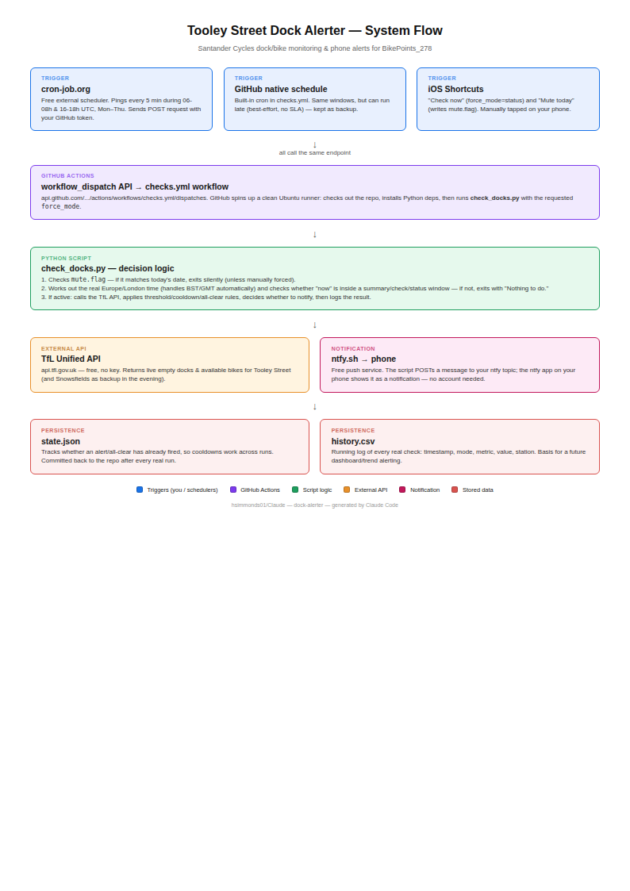
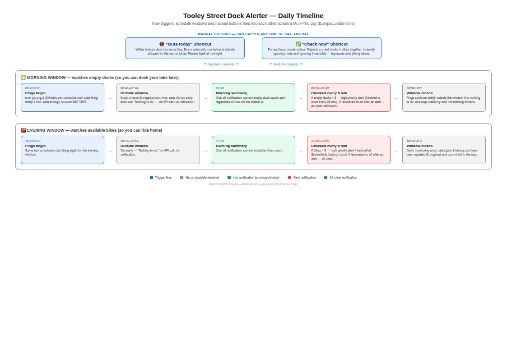

# Architecture

Two reference diagrams for how this project fits together. Generated as HTML/CSS
rendered to A4 via headless Chromium, not hand-drawn — regenerate by editing the
HTML source if anything changes (see `docs/` for the rendered PNGs; HTML source
isn't checked in, regenerate from scratch if needed).

## Component diagram (`docs/architecture.png`)

Top-to-bottom view of the pieces and how data flows through them in a single run:
triggers (cron-job.org / GitHub's own schedule / iOS Shortcuts) -> GitHub Actions
`workflow_dispatch` -> `check_docks.py`'s decision logic -> the TfL API and ntfy.sh
-> `state.json` / `history.csv` persisted back to the repo.

## Daily timeline (`docs/timeline.png`)

Left-to-right view of how the same pieces play out across a Mon-Thu day: the
morning window (watches empty docks) and evening window (watches available
bikes) as parallel tracks, each showing the no-op/summary/check/all-clear
stages in sequence, plus the Mute and Check-now Shortcuts shown as anytime
inputs that override or bypass the scheduled flow.

